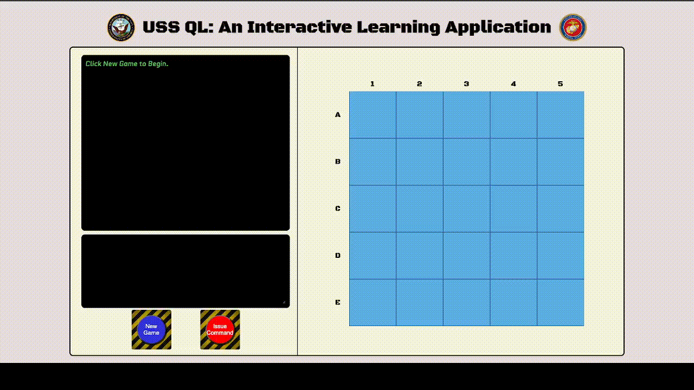
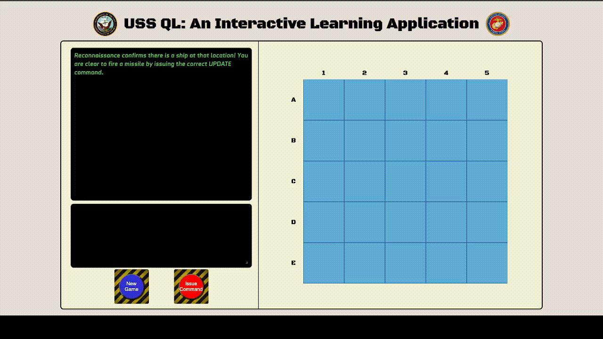
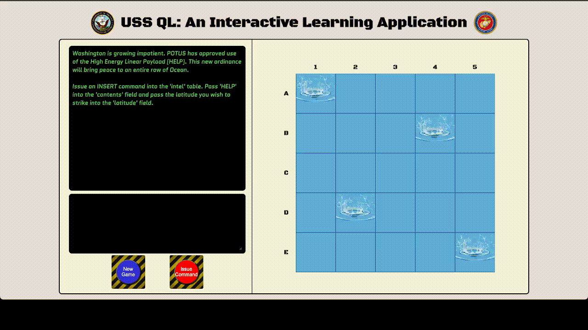

# 💥 🚢 USS QL 🚢 💥
 
 
 
 
 


USS QL is an interactive learning platform for users to practice SQL queries to reinforce SQL syntax in an engaging and entertaining format.

<picture>
  <source media="(prefers-color-scheme: dark)" srcset="./client/assets/readme/gameIntro.gif">
  <source media="(prefers-color-scheme: light)" srcset="./client/assets/readme/gameIntro.gif">
  
</picture>

# Installation

MacOS (Install dependencies)
```bash
% npm install
```

WindowsOS (Install dependencies)
```bash
$ npm install 
```

# Usage

MacOS (Run dev server)
```bash
% npm run dev 
```

WindowsOS (Run dev server)
```bash
$ npm run dev 
```

# Gameplay Instructions

1. Click "New Game" button.
2. Make SELECT query to make board selection
3. If enemy ship is at location, make UPDATE query to hit ship

    <picture>
      <source media="(prefers-color-scheme: dark)" srcset="./client/assets/readme/updateSuccess.gif">
      <source media="(prefers-color-scheme: light)" srcset="./client/assets/readme/updateSuccess.gif">
      
    </picture>

4. If player has 'HELP' munitions (3 Turns), make INSERT query to deploy

    <picture>
      <source media="(prefers-color-scheme: dark)" srcset="./client/assets/readme/insert.gif">
      <source media="(prefers-color-scheme: light)" srcset="./client/assets/readme/insert.gif">
      
    </picture>

**NOTE:** Each input made by user will be checked for the correct format/syntax

# Iteration Roadmap
1. *Dynamic gameboard:*
    - Ability for user to scale gameboard size
2. *Improve player input ***queryString*** read functionality:*
    - Current state: user must use exact stylistic syntax (i.e. spaces)
    - Desired state: player input is interpreted, exact stylistic syntax not required
3. *Multiplayer/AI:*
    - 2 player mode
    - Enemy AI 
4. *User Authentication:*
    - User would be able to keep track of score


# Known Bugs
1. Player has ability to input SQL query before player prompt has fully rendered (async issue).
2. Using the 'HELP' feature and hitting the ship entirely does not render the 'game over' prompt.


# Contact Info
| Developed By |    |    |
| :---:   | :---: | :---: |
| Josh Howard  | [](https://github.com/JoshHowardDev)   | [](https://linkedin.com/in/JoshHowardDev)   |
| William Lee  | [](https://github.com/WilliamHaakLee)   | [](https://www.linkedin.com/in/williamhaaklee)   |
| Brandon Tran  | [](https://github.com/btran140)   | [](https://linkedin.com/in/btran140)   |
| Chris Oakes  | [](https://github.com/ckoakes)   | [](https://www.linkedin.com/in/christopher-k-oakes/)   |